<h1 align="center">
  
Koordetector

</h1>

[English](./README.md) | 简体中文

## 介绍

Koordetector是Koodinator干扰检测功能的辅助性项目。它的目标是以插件化的形式扩展Koordinator收集性能指标的能力，并承担部分性能指标分析的职责，它能够向Koordinator反馈某些pod是否受到干扰的结论，同时也起到一种类似SIG的作用：探索高级指标的收集技术与实现方案，如eBPF技术。

Koordetector通过将性能指标分为两种类型来完善干扰检测功能。一种是适合在单机上随时采集随时分析的指标，比如PSI，是一个有通用的异常阈值的百分比类型的数值。另一种是需要根据工作负载本身进行分析的指标，比如CPI，不同的应用有不同的取值范围。Koordetector通过名为`Interference Manager`的组件处理第二种类型的指标，该组件在控制平面中运行，按工作负载收集和汇总指标，并使用各种策略对它们进行综合分析。这两种类型的指标的分析结论都会反馈给Koordinator以供进一步使用。

Koordetector 通过提供以下功能来实现上述目标：

- 精心设计的插件式框架，用于管理来自 Koordinator、Koordetector 和第三方的指标收集工具。
- 完整高效的数据聚合链路，借助直方图算法、滑动窗口、TSDB、Prometheus 或自定义指标服务器等，保证优秀的干扰检测准确度和可接受的开销。
- 智能化的干扰检测算法和策略，包括简单经验阈值法、机器学习方法、深度学习方法等。
- 一组指标采集工具和与之匹配的解决方案文档及演示demo，例如，通过eBPF实现的 CPU 调度延迟收集器以及其在不同内核版本上的兼容性解决方案。

## 行为守则

Koordetector是Koordinator的一部分，并遵照与之相同的[行为守则](CODE_OF_CONDUCT.md)。我们鼓励每个人在参与之前先读一下它。

为了营造一个开放和热情的环境，我们作为贡献者和维护者承诺：无论年龄、体型、残疾、种族、经验水平、教育程度、社会经济地位、国籍、个人外貌、种族、宗教或性认同和性取向如何，参与我们的项目和社区的每个人都不会受到骚扰。

## 贡献

我们非常欢迎每一位社区同学共同参与 Koordetector的建设，你可以从 [CONTRIBUTING.md](CONTRIBUTING.md) 手册开始。

## License

Koordetector is licensed under the Apache License, Version 2.0. See [LICENSE](./LICENSE) for the full license text.